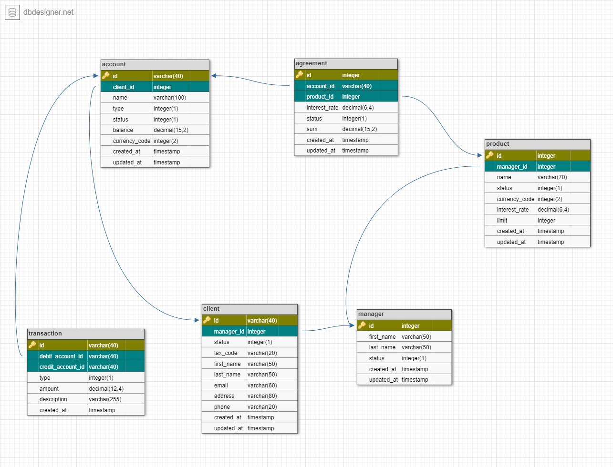

# GutBank Project (Backend-Part)

## Project Overview

GutBank is a banking web application model. This project represents the backend part, implementing the core services
connected to a MySQL database.

### Key Features

- CRUD operations for customers, accounts, products, agreements, and transactions.
- Management of customer accounts and banking products.
- Transaction support with type and currency considerations.
- Customer-bank agreements processing.

---

## Database Structure

### Database Schema

For a visual representation, refer to the database schema diagram:  


### Tables Overview

#### Table: **Client**

| **Column Name** | **Type**      | **Description**                               |
|-----------------|---------------|-----------------------------------------------|
| `id`            | `int`         | Unique identifier for the client.             |
| `manager_id`    | `binary(16)`  | Identifier of the assigned manager.           |
| `status`        | `int(1)`      | Status of the client (e.g., active/inactive). |
| `tax_code`      | `varchar(20)` | Client's tax code.                            |
| `first_name`    | `varchar(50)` | First name of the client.                     |
| `last_name`     | `varchar(50)` | Last name of the client.                      |
| `email`         | `varchar(60)` | Client's email address.                       |
| `address`       | `varchar(80)` | Client's residential address.                 |
| `phone`         | `varchar(20)` | Client's phone number.                        |
| `created_at`    | `timestamp`   | Timestamp when the row was created.           |
| `updated_at`    | `timestamp`   | Timestamp when the row was last updated.      |

#### Table: **Account**

| **Column Name** | **Type**        | **Description**                          |
|-----------------|-----------------|------------------------------------------|
| `id`            | `binary(16)`    | Unique identifier for the account.       |
| `client_id`     | `binary(16)`    | ID of the associated client.             |
| `name`          | `varchar(100)`  | Name of the account.                     |
| `type`          | `int(1)`        | Type of the account.                     |
| `status`        | `int(1)`        | Account status.                          |
| `balance`       | `numeric(15,2)` | Account balance in currency.             |
| `currency_code` | `int(2)`        | Currency code of the account.            |
| `created_at`    | `timestamp`     | Timestamp when the row was created.      |
| `updated_at`    | `timestamp`     | Timestamp when the row was last updated. |

#### Table: **Product**

| **Column Name** | **Type**        | **Description**                                |
|-----------------|-----------------|------------------------------------------------|
| `id`            | `int`           | Unique identifier for the product.             |
| `manager_id`    | `int`           | ID of the managing employee.                   |
| `name`          | `varchar(70)`   | Name of the product.                           |
| `status`        | `int(1)`        | Status of the product (e.g., active/inactive). |
| `currency_code` | `int(2)`        | Currency of the product.                       |
| `interest_rate` | `numeric(6,4)`  | Product's interest rate.                       |
| `limit`         | `numeric(15,2)` | Credit limit (0 for no limit, >0 for limited). |
| `created_at`    | `timestamp`     | Timestamp when the row was created.            |
| `updated_at`    | `timestamp`     | Timestamp when the row was last updated.       |

#### Table: **Agreement**

| **Column Name** | **Type**        | **Description**                          |
|-----------------|-----------------|------------------------------------------|
| `id`            | `int`           | Unique identifier for the agreement.     |
| `account_id`    | `binary(16)`    | ID of the associated account.            |
| `product_id`    | `int`           | ID of the associated product.            |
| `interest_rate` | `numeric(6,4)`  | Current interest rate for the agreement. |
| `status`        | `int`           | Agreement status.                        |
| `sum`           | `numeric(15,2)` | Agreement amount.                        |
| `created_at`    | `timestamp`     | Timestamp when the row was created.      |
| `updated_at`    | `timestamp`     | Timestamp when the row was last updated. |

#### Table: **Transaction**

| **Column Name**     | **Type**        | **Description**                             |
|---------------------|-----------------|---------------------------------------------|
| `id`                | `binary(16)`    | Unique identifier for the transaction.      |
| `debit_account_id`  | `binary(16)`    | Debit account involved in the transaction.  |
| `credit_account_id` | `binary(16)`    | Credit account involved in the transaction. |
| `type`              | `int(1)`        | Type of transaction.                        |
| `amount`            | `numeric(12,2)` | Transaction amount.                         |
| `description`       | `varchar(255)`  | Description of the transaction.             |
| `created_at`        | `timestamp`     | Timestamp when the row was created.         |

#### Table: **Manager**

| **Column Name** | **Type**       | **Description**                         |
|-----------------|----------------|-----------------------------------------|
| `id`            | `int`          | Unique identifier for the manager.      |
| `first_name`    | `varchar(50)`  | Manager's first name.                   |
| `last_name`     | `varchar(50)`  | Manager's last name.                    |
| `status`        | `int`          | Manager's status.                       |
| `description`   | `varchar(255)` | Additional description for the manager. |
| `created_at`    | `timestamp`    | Timestamp when the row was created.     |

---

## Project Structure

```plaintext
src/
├── main/
│   ├── java/
│   │   └── gutbank/
│   │       ├── aspect/           # Aspects for logging.
│   │       ├── controller/       # REST controllers for APIs.
│   │       ├── dto/              # Data Transfer Objects.
│   │       ├── entity/           # Entities representing database tables.
│   │       ├── exception/        # Custom exceptions and handlers.
│   │       ├── mapper/           # Mappers between DTOs and entities.
│   │       ├── repository/       # Spring Data JPA repositories.
│   │       ├── service/          # Service layer containing business logic.
│   │       │   └── impl/         # Service implementations.
│   │       └── GutBankApplication # Main Spring Boot application class.
│   └── resources/                 # Application resources (config files, etc.).
└── test/
    ├── java/
    │   └── gutbank/
    │       ├── controller/        # Controller tests.
    │       ├── mapper/            # Mapper tests.
    │       └── service/           # Service tests.
    └── resources/                 # Test-specific resources and configurations.
```
## Instructions for Running the Project
Prerequisites
Ensure the following tools are installed on your machine:

Java Development Kit (JDK) 17+
MySQL (Version 8.0 or higher recommended)
Maven (For dependency management and building the project)
Step 1: Clone the Repository
Clone the Git repository to your local machine:

git clone https://github.com/OleksiyKharkiv/GutBank
cd gutbank
Step 2: Configure the Database
Create a new MySQL database named gutbank (or any name of your choice).
Update the database connection properties in src/main/resources/application.properties:
spring.datasource.url=jdbc:mysql://localhost:3306/gutbank
spring.datasource.username=your_db_username
spring.datasource.password=your_db_password
spring.jpa.hibernate.ddl-auto=update
Step 3: Build the Project
Use Maven to download dependencies and build the project:

mvn clean install
Step 4: Run the Application
Run the application using the Spring Boot Maven plugin:

mvn spring-boot:run
Alternatively, if you prefer running the compiled JAR file:

java -jar target/gutbank-0.0.1-SNAPSHOT.jar
Step 5: Access the Application
Once the application starts, it will be available at:
http://localhost:8080

Step 6: Testing the APIs
You can use tools like Postman or curl to interact with the REST APIs.
Alternatively, if Swagger is configured, access the API documentation at:
http://localhost:8080/swagger-ui.html

Running Tests
Run the unit and integration tests with Maven:

mvn test
Test reports will be generated in the target/surefire-reports/ directory.

Troubleshooting
Port Conflict: If port 8080 is already in use, change the port in application.properties:
server.port=8081
Database Connection Error: Ensure your MySQL database is running and the credentials in application.properties are correct.

Build Issues: Run mvn dependency:purge-local-repository to clean and refresh dependencies.
